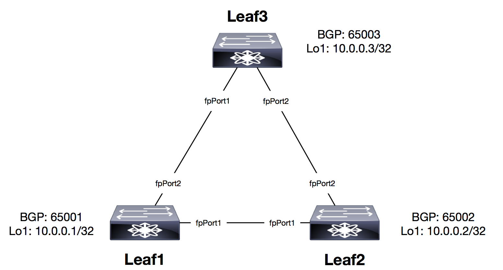

# Lab 1 - Introduction to FlexSwitch 

This lab serves as an introduction to SnapRoute FlexSwitch.  It uses a three 
node, full-mesh topology and walks the user through basic interface 
configuration and validation. eBGP is configured and loopback interfaces are
redistributed along with route validation.

This lab is implemented in the following stages:

* [Stage 1](#stage-1) Enable LLDP and verify L1 connectivity
* [Stage 2](#stage-2) Configure IP address and verify L2/L3 connectivity
* [Stage 3](#stage-3) Enable eBGP on directly connected interfaces and verify neighborship
* [Stage 4](#stage-4) Redistribute connected interfaces and verify routes are present

**labtool** can initialize the setup in any stage using the _--stage_ option. For example, to complete the full configuration you can initialize the lab in the finally stage:

```bash
user1@ubuntu:~/dockerLab$ sudo python ./labtool.py --lab lab1 --stage 4
```

## Getting Started

To start the lab, enter the dockerLab folder created during [docker lab install](../../installing_docker.md) procedure and execute the **labtool.py** script with _--lab_ argument **lab1** as shown below.

```bash
user1@ubuntu:~/dockerLab$ sudo python ./labtool.py --lab lab1

```

## Topology



### IP Information

| Device   | BGP ASN | Loopback1   | fpPort1     |  fpPort2    |
| -------- |:--------|:-----------:|:-----------:| -----------:|
| leaf1    | 65001   | 10.0.0.1/32 | 10.1.1.1/30 | 10.1.3.1/30 |
| leaf2    | 65002   | 10.0.0.2/32 | 10.1.1.2/30 | 10.1.2.1/30 |
| leaf3    | 65003   | 10.0.0.3/32 | 10.1.3.2/30 | 10.1.2.2/30 |


## API

### Introduction to the API

FlexSwitch comes with a RestFul API that can be used for configuration, state 
querying, and troubleshooting of protocols and system daemons.

The table below maps standard REST operations to the corresponding HTTP 
method.

| Operation   | HTTP Method | 
| ----------- | -----------:|
| Create      | POST        | 
| Read        | GET         | 
| Update      | PATCH       | 
| Delete      | DELETE      | 

Further documentation on FlexSwitch API, Objects, and URLs is available on
[opensnaproute.github.io/docs](https://opensnaproute.github.io/docs/apis.html)


### Accessing the API

The FlexSwitch API is exposed on port 8080 on each device. Since there are 
multiple containers, each is assigned a custom local port that maps to 8080.

You can execute curl commands from your localhost to the specific port below
to access the API on each device, or connect to the shell and execute them
against port 8080. 
 
For consistency, all commands in this lab are executed 
against port 8080 from the container's bash shell.

| Device   | Container Port | Host Port |
| -------- |:--------------:| ---------:|
| leaf1    | 8080           | 8001      |
| leaf2    | 8080           | 8002      |
| leaf3    | 8080           | 8003      |

####Example

Access the SystemParam object from outside or inside the container

Verify containers are running:

```bash
user1@ubuntu:~/snaproute$ docker ps
CONTAINER ID        IMAGE                COMMAND                  CREATED             STATUS              PORTS                    NAMES
7cc4268723c4        snapos/flex:latest   "/bin/sh -c 'sh /u..."   32 minutes ago      Up 32 minutes       0.0.0.0:8003->8080/tcp   leaf3
945d36d0d0b7        snapos/flex:latest   "/bin/sh -c 'sh /u..."   32 minutes ago      Up 32 minutes       0.0.0.0:8002->8080/tcp   leaf2
dffca4de7932        snapos/flex:latest   "/bin/sh -c 'sh /u..."   32 minutes ago      Up 32 minutes       0.0.0.0:8001->8080/tcp   leaf1
```
Read the SystemParam from outside of the container:

```bash
user1@ubuntu:~/snaproute$ curl -s 'http://localhost:8001/public/v1/config/SystemParam' | python -m json.tool
{
    "Object": {
        "Description": "FlexSwitch System",
        "Hostname": "leaf1",
        "MgmtIp": "172.17.0.2",
        "SwVersion": "1.0.1.22",
        "SwitchMac": "02:42:ac:11:00:03",
        "Vrf": "default"
    },
    "ObjectId": "1f73d977-164d-4ff8-7564-3e28e573af0f"
}
```

Access bash shell of container _leaf1_ and read the SystemParam object:

```bash
user1@ubuntu:~/snaproute$ docker exec -it leaf1 bash
root@leaf1:/#
root@leaf1:/# curl -s 'http://localhost:8080/public/v1/config/SystemParam' | python -m json.tool
{
    "Object": {
        "Description": "FlexSwitch System",
        "Hostname": "leaf1",
        "MgmtIp": "172.17.0.2",
        "SwVersion": "1.0.1.22",
        "SwitchMac": "02:42:ac:11:00:03",
        "Vrf": "default"
    },
    "ObjectId": "1f73d977-164d-4ff8-7564-3e28e573af0f"
}
```

### Accessing the CLI 

In addition to the API, FlexSwitch offers a CLI for configuration and  verification. Throughout this lab, each step is performed using both the API and the CLI. You can access the CLI by following these steps:


1. Access the bash shell of the leaf:
```bash
user1@ubuntu:~/snaproute$ docker exec -it leaf1 bash
root@leaf1:/#
```
 
1. Change to the correct directory:
```bash
root@leaf1:/# cd /opt/flexswitch/apps/cli2/
root@leaf1:/opt/flexswitch/apps/cli2#
```
1. Execute the SnapRoute CLI script: 
 
	```bash
	root@leaf1:/opt/flexswitch/apps/cli2# python ./snap_cli.py
	WARNING: Failed to execute tcpdump. Check it is installed and in the PATH
	WARNING: No route found for IPv6 destination :: (no default route?)
	loading schema...
	loading model...
	 _______  __       __________   ___      _______.____    __    ____  __  .___________.  ______  __    __
	|   ____||  |     |   ____\  \ /  /     /       |\   \  /  \  /   / |  | |           | /      ||  |  |  |
	|  |__   |  |     |  |__   \  V  /     |   (----` \   \/    \/   /  |  | `---|  |----`|  ,----'|  |__|  |
	|   __|  |  |     |   __|   >   <       \   \      \            /   |  |     |  |     |  |     |   __   |
	|  |     |  `----.|  |____ /  .  \  .----)   |      \    /\    /    |  |     |  |     |  `----.|  |  |  |
	|__|     |_______||_______/__/ \__\ |_______/        \__/  \__/     |__|     |__|      \______||__|  |__|
	                                _______  __       __
	                               /       ||  |     |  |
	                              |   ,----||  |     |  |
	                              |   |     |  |     |  |
	                              |   `----.|  `----.|  |
	                               \_______||_______||__|
	
	FlexSwitch Console Version 1.0.0.190, Connected to: leaf1 Version 1.0.1.22.0
	Using snap style cli
	
	leaf1>
	``` 
  
4. Enter 'enable' to access the enable prompt:

```bash
leaf1>enable
leaf1#
```

## Stage 1

To enable LLDP, send an update to the LLDPGlobal object with the _Enable_ attribute set to True.  

Repeat this on all leaves. Finally, verify that neighbors are seen by reading the LLDPIntf state object.

### API

```bash
root@leaf1:/# curl -sX PATCH -d '{"Enable":true}' 'http://localhost:8080/public/v1/config/LLDPGlobal' | python -m json.tool
{
    "Access-Control-Allow-Headers": "Origin, X-Requested-With, Content-Type, Accept",
    "Access-Control-Allow-Methods": "POST, GET, OPTIONS, PATCH, DELETE",
    "Access-Control-Allow-Origin": "*",
    "Access-Control-Max_age": "86400",
    "ObjectId": "efb228f4-e15e-43ec-7a7a-40a83a0aa401",
    "Result": "Success"
}

root@leaf1:~# curl -s 'http://localhost:8080/public/v1/state/LLDPIntfs' | python -m json.tool
{
    "CurrentMarker": 0,
    "MoreExist": false,
    "NextMarker": 0,
    "ObjCount": 3,
    "Objects": [
        {
            "Object": {
                "Enable": true,
                "EnabledCapabilities": "",
                "HoldTime": "",
                "IfIndex": 0,
                "IntfRef": "eth0",
                "LocalPort": "eth0",
                "PeerHostName": "",
                "PeerMac": "",
                "PeerPort": "",
                "PortDescription": "",
                "ReceivedFrames": 0,
                "SendFrames": 565,
                "SystemCapabilities": "",
                "SystemDescription": "",
                "VlanId": 0
            },
            "ObjectId": "405fbe2e-f3ec-42f4-41bc-bb20cdcdadc7"
        },
        {
            "Object": {
                "Enable": true,
                "EnabledCapabilities": "",
                "HoldTime": "1m46.475105667s",
                "IfIndex": 1,
                "IntfRef": "fpPort1",
                "LocalPort": "fpPort1",
                "PeerHostName": "leaf2",
                "PeerMac": "3e:19:a9:4f:99:8c",
                "PeerPort": "fpPort1",
                "PortDescription": "Host ethernet Port",
                "ReceivedFrames": 47,
                "SendFrames": 531,
                "SystemCapabilities": "",
                "SystemDescription": "FlexSwitch System",
                "VlanId": 3050
            },
            "ObjectId": "7494c4c0-a4ee-41d8-4080-efd33bb867e6"
        },
        {
            "Object": {
                "Enable": true,
                "EnabledCapabilities": "",
                "HoldTime": "1m31.223135787s",
                "IfIndex": 2,
                "IntfRef": "fpPort2",
                "LocalPort": "fpPort2",
                "PeerHostName": "leaf3",
                "PeerMac": "5a:28:43:9d:51:15",
                "PeerPort": "fpPort1",
                "PortDescription": "Host ethernet Port",
                "ReceivedFrames": 42,
                "SendFrames": 529,
                "SystemCapabilities": "",
                "SystemDescription": "FlexSwitch System",
                "VlanId": 3050
            },
            "ObjectId": "76cdd911-0d2d-4b44-4099-34027ebc2a95"
        }
    ]
}

```
### CLI

```bash
leaf1#config
*** Configuration will only be applied once 'apply' command is entered ***
leaf1(config)#lldp enable
leaf1(config)#apply

leaf1#show lldp neighbors
Applying Show:

Interface eth0
  IfIndex is 0
  Peer Port is
  Peer HostName is
  Peer Port Description is
  Peer Mac Address is
  Peer HoldTime is
  Vlan Id is 0
  System Description is
  System Capabilities is
  Enabled Capabilities is
  Send Frames is 567
  Received Frames is 0
  Enabled: True

Interface fpPort1
  IfIndex is 1
  Peer Port is fpPort1
  Peer HostName is leaf2
  Peer Port Description is Host ethernet Port
  Peer Mac Address is 3e:19:a9:4f:99:8c
  Peer HoldTime is 1m37.713274617s
  Vlan Id is 3050
  System Description is FlexSwitch System
  System Capabilities is
  Enabled Capabilities is
  Send Frames is 533
  Received Frames is 49
  Enabled: True

Interface fpPort2
  IfIndex is 2
  Peer Port is fpPort1
  Peer HostName is leaf3
  Peer Port Description is Host ethernet Port
  Peer Mac Address is 5a:28:43:9d:51:15
  Peer HoldTime is 1m52.505292633s
  Vlan Id is 3050
  System Description is FlexSwitch System
  System Capabilities is
  Enabled Capabilities is
  Send Frames is 532
  Received Frames is 45
  Enabled: True

```

## Stage 2

To enable the interface, send an update to the Port object referencing _fpPort1_ and set
_AdminState_ to _UP_. To configure the interface as L3, create an _IPv4Intf_ with
_IpAddr_ referencing _fpPort1_.  Ensure that the AdminState of the IPv4Intf is UP.
Repeat for interface fpPort2.

For loopback interfaces, send a create (POST) request for _LogicalIntf_ specifying the name of
the loopback interface. Then, similar to the fpPort1, create an IPv4Intf object
with the appropriate IP address referencing Loopback1.

Finally, verify the state by reading the IPv4Intf state object.

Repeat the appropriate configuration for remaining leaves in the topology.
Verify connectivty via ping.

### API

```bash
root@leaf1:~# curl -sX PATCH -d '{"IntfRef":"fpPort1", "AdminState":"UP"}' 'http://localhost:8080/public/v1/config/Port' | python -m json.tool
{
    "Access-Control-Allow-Headers": "Origin, X-Requested-With, Content-Type, Accept",
    "Access-Control-Allow-Methods": "POST, GET, OPTIONS, PATCH, DELETE",
    "Access-Control-Allow-Origin": "*",
    "Access-Control-Max_age": "86400",
    "ObjectId": "c9d260cc-dee0-4f34-478d-83b6586209a1",
    "Result": "Success"
}
root@leaf1:~# curl -sX PATCH -d '{"IntfRef":"fpPort2", "AdminState":"UP"}' 'http://localhost:8080/public/v1/config/Port' | python -m json.tool
{
    "Access-Control-Allow-Headers": "Origin, X-Requested-With, Content-Type, Accept",
    "Access-Control-Allow-Methods": "POST, GET, OPTIONS, PATCH, DELETE",
    "Access-Control-Allow-Origin": "*",
    "Access-Control-Max_age": "86400",
    "ObjectId": "9d8da78c-b32f-4d29-70b5-f237b6d4f5ff",
    "Result": "Success"
}

root@leaf1:~# curl -sX POST -d '{"IntfRef":"fpPort1", "AdminState":"UP", "IpAddr":"10.1.1.1/30"}' 'http://localhost:8080/public/v1/config/IPv4Intf' | python -m json.tool
{
    "Access-Control-Allow-Headers": "Origin, X-Requested-With, Content-Type, Accept",
    "Access-Control-Allow-Methods": "POST, GET, OPTIONS, PATCH, DELETE",
    "Access-Control-Allow-Origin": "*",
    "Access-Control-Max_age": "86400",
    "ObjectId": "afd6c022-a8f6-4274-670b-5c04915f06e2",
    "Result": "Success"
}

root@leaf1:/# curl -sX POST -d '{"IntfRef":"fpPort2", "AdminState":"UP", "IpAddr":"10.1.3.1/30"}' 'http://localhost:8080/public/v1/config/IPv4Intf' | python -m json.tool
{
    "Access-Control-Allow-Headers": "Origin, X-Requested-With, Content-Type, Accept",
    "Access-Control-Allow-Methods": "POST, GET, OPTIONS, PATCH, DELETE",
    "Access-Control-Allow-Origin": "*",
    "Access-Control-Max_age": "86400",
    "ObjectId": "0210f75c-d601-49f6-660f-176ad8345aa1",
    "Result": "Success"
}

root@leaf1:~# curl -sX POST -d '{"Name":"Loopback1"}' 'http://localhost:8080/public/v1/config/LogicalIntf' | python -m json.tool
{
    "Access-Control-Allow-Headers": "Origin, X-Requested-With, Content-Type, Accept",
    "Access-Control-Allow-Methods": "POST, GET, OPTIONS, PATCH, DELETE",
    "Access-Control-Allow-Origin": "*",
    "Access-Control-Max_age": "86400",
    "ObjectId": "287dd6c0-908f-4415-4a24-e3c33465c2e1",
    "Result": "Success"
}

root@leaf1:~# curl -sX POST -d '{"IntfRef":"Loopback1", "AdminState":"UP", "IpAddr":"10.0.0.1/32"}' 'http://localhost:8080/public/v1/config/IPv4Intf' | python -m json.tool
{
    "Access-Control-Allow-Headers": "Origin, X-Requested-With, Content-Type, Accept",
    "Access-Control-Allow-Methods": "POST, GET, OPTIONS, PATCH, DELETE",
    "Access-Control-Allow-Origin": "*",
    "Access-Control-Max_age": "86400",
    "ObjectId": "d8b47b66-90e6-493d-4bf6-951403c14ff6",
    "Result": "Success"
}

root@leaf1:~# curl -s 'http://localhost:8080/public/v1/state/IPv4Intfs' | python -m json.tool
{
    "CurrentMarker": 0,
    "MoreExist": false,
    "NextMarker": 2,
    "ObjCount": 2,
    "Objects": [
        {
            "Object": {
                "IfIndex": 1,
                "IntfRef": "fpPort1",
                "IpAddr": "10.1.1.1/30",
                "L2IntfId": 1,
                "L2IntfType": "port",
                "LastDownEventTime": "",
                "LastUpEventTime": "",
                "NumDownEvents": 0,
                "NumUpEvents": 0,
                "OperState": "UP"
            },
            "ObjectId": "afd6c022-a8f6-4274-670b-5c04915f06e2"
        },
        {
            "Object": {
                "IfIndex": 83886080,
                "IntfRef": "Loopback1",
                "IpAddr": "10.0.0.1/32",
                "L2IntfId": 0,
                "L2IntfType": "loopback",
                "LastDownEventTime": "",
                "LastUpEventTime": "",
                "NumDownEvents": 0,
                "NumUpEvents": 0,
                "OperState": "UP"
            },
            "ObjectId": "d8b47b66-90e6-493d-4bf6-951403c14ff6"
        },
        {
            "Object": {
                "IfIndex": 2,
                "IntfRef": "fpPort2",
                "IpAddr": "10.1.3.1/30",
                "L2IntfId": 2,
                "L2IntfType": "port",
                "LastDownEventTime": "",
                "LastUpEventTime": "",
                "NumDownEvents": 0,
                "NumUpEvents": 0,
                "OperState": "UP"
            },
            "ObjectId": "0210f75c-d601-49f6-660f-176ad8345aa1"
        }
    ]
}

```

### CLI

```bash
leaf1#conf

*** Configuration will only be applied once 'apply' command is entered ***

leaf1(config)#interface fpPort 1
leaf1(config-if-fpPort-1)#ip address 10.1.1.1/30
leaf1(config-if-fpPort-1-ip-10.1.1.1/30)#no shut
leaf1(config-if-fpPort-1-ip-10.1.1.1/30)#apply

leaf1(config)#interface fpPort 2
leaf1(config-if-fpPort-1)#ip address 10.1.3.1/30
leaf1(config-if-fpPort-1-ip-10.1.1.1/30)#no shut
leaf1(config-if-fpPort-1-ip-10.1.1.1/30)#apply

leaf1(config)#interface logical Loopback1
leaf1(config-if)#ip address 10.0.0.1/32
leaf1(config-if-ip-10.0.0.1/32)#no shut
leaf1(config-if-ip-10.0.0.1/32)#apply

leaf1(config)#show ip interface
Applying Show:

------------------------------------------------------------------
 Interface    IP Address     OperState    DownEvents    Last Flap
------------------------------------------------------------------
 fpPort1      10.1.1.1/30    UP           0
 Loopback1    10.0.0.1/32    UP           0
 fpPort2      10.1.3.1/30    UP           0

```

## Stage 3

The first step is to update the BGPGlobal object setting the ASN and RouterID.
Next, create a BGPv4Neighbor object specifying the Neighbor IP address,
PeerAS, and UpdateSource for both interfaces fpPort1 and fpPort2.

Repeat on all leaves.  Verify that the _BGPGlobal_ state object has the correct
attributes and that the neighbors are in established state.

### API

```
root@leaf1:/#  curl -sX PATCH -d '{"ASNum":"65001","RouterId":"10.0.0.1"}' 'http://localhost:8080/public/v1/config/BGPGlobal' | python -m json.tool
{
    "Access-Control-Allow-Headers": "Origin, X-Requested-With, Content-Type, Accept",
    "Access-Control-Allow-Methods": "POST, GET, OPTIONS, PATCH, DELETE",
    "Access-Control-Allow-Origin": "*",
    "Access-Control-Max_age": "86400",
    "ObjectId": "ea26be22-0b6e-4dc3-53c4-d90a58b5834d",
    "Result": "Success"
}

root@leaf1:/#  curl -sX POST -d '{"NeighborAddress":"10.1.1.2","PeerAS":"65002","UpdateSource":"10.1.1.1"}' 'http://localhost:8080/public/v1/config/BGPv4Neighbor' | python -m json.tool
{
    "Access-Control-Allow-Headers": "Origin, X-Requested-With, Content-Type, Accept",
    "Access-Control-Allow-Methods": "POST, GET, OPTIONS, PATCH, DELETE",
    "Access-Control-Allow-Origin": "*",
    "Access-Control-Max_age": "86400",
    "ObjectId": "d0d44606-002d-404a-72a5-ef749d4f5b61",
    "Result": "Success"
}

root@leaf1:/#   curl -sX POST -d '{"NeighborAddress":"10.1.3.2","PeerAS":"65003","UpdateSource":"10.1.3.1"}' 'http://localhost:8080/public/v1/config/BGPv4Neighbor' | python -m json.tool
{
    "Access-Control-Allow-Headers": "Origin, X-Requested-With, Content-Type, Accept",
    "Access-Control-Allow-Methods": "POST, GET, OPTIONS, PATCH, DELETE",
    "Access-Control-Allow-Origin": "*",
    "Access-Control-Max_age": "86400",
    "ObjectId": "74574ea5-75be-4efa-415d-9e42d2103ef4",
    "Result": "Success"
}

root@leaf1:~#  curl -s GET 'http://localhost:8080/public/v1/state/BGPGlobal' | python -m json.tool
{
    "Object": {
        "AS": "65001",
        "DefaultMED": 0,
        "Defaultv4Route": false,
        "Defaultv6Route": false,
        "Disabled": false,
        "EBGPAllowMultipleAS": false,
        "EBGPMaxPaths": 0,
        "IBGPMaxPaths": 0,
        "RouterId": "10.0.0.1",
        "TotalPaths": 0,
        "Totalv4Prefixes": 0,
        "Totalv6Prefixes": 0,
        "UseMultiplePaths": false,
        "Vrf": "default"
    },
    "ObjectId": ""
}

root@leaf1:~#  curl -s GET 'http://localhost:8080/public/v1/state/BGPv4Neighbors' | python -m json.tool
{
    "CurrentMarker": 0,
    "MoreExist": false,
    "NextMarker": 0,
    "ObjCount": 2,
    "Objects": [
        {
            "Object": {
                "AddPathsMaxTx": 0,
                "AddPathsRx": false,
                "AdjRIBInFilter": "",
                "AdjRIBOutFilter": "",
                "AuthPassword": "",
                "BfdNeighborState": "",
                "ConnectRetryTime": 120,
                "Description": "",
                "Disabled": false,
                "HoldTime": 180,
                "IntfRef": "",
                "KeepaliveTime": 60,
                "LocalAS": "65001",
                "MaxPrefixes": 0,
                "MaxPrefixesDisconnect": false,
                "MaxPrefixesRestartTimer": 0,
                "MaxPrefixesThresholdPct": 80,
                "Messages": {
                    "Received": {
                        "Notification": 0,
                        "Update": 0
                    },
                    "Sent": {
                        "Notification": 0,
                        "Update": 0
                    }
                },
                "MultiHopEnable": false,
                "MultiHopTTL": 0,
                "NeighborAddress": "10.1.1.2",
                "NextHopSelf": false,
                "PeerAS": "65002",
                "PeerGroup": "",
                "PeerType": 1,
                "Queues": {
                    "Input": 0,
                    "Output": 0
                },
                "RouteReflectorClient": false,
                "RouteReflectorClusterId": 0,
                "SessionState": 6,
                "SessionStateDuration": "4m41.303925641s",
                "TotalPrefixes": 0,
                "UpdateSource": "10.1.1.1"
            },
            "ObjectId": "d0d44606-002d-404a-72a5-ef749d4f5b61"
        },
        {
            "Object": {
                "AddPathsMaxTx": 0,
                "AddPathsRx": false,
                "AdjRIBInFilter": "",
                "AdjRIBOutFilter": "",
                "AuthPassword": "",
                "BfdNeighborState": "",
                "ConnectRetryTime": 120,
                "Description": "",
                "Disabled": false,
                "HoldTime": 180,
                "IntfRef": "",
                "KeepaliveTime": 60,
                "LocalAS": "65001",
                "MaxPrefixes": 0,
                "MaxPrefixesDisconnect": false,
                "MaxPrefixesRestartTimer": 0,
                "MaxPrefixesThresholdPct": 80,
                "Messages": {
                    "Received": {
                        "Notification": 0,
                        "Update": 0
                    },
                    "Sent": {
                        "Notification": 0,
                        "Update": 0
                    }
                },
                "MultiHopEnable": false,
                "MultiHopTTL": 0,
                "NeighborAddress": "10.1.3.2",
                "NextHopSelf": false,
                "PeerAS": "65003",
                "PeerGroup": "",
                "PeerType": 1,
                "Queues": {
                    "Input": 0,
                    "Output": 0
                },
                "RouteReflectorClient": false,
                "RouteReflectorClusterId": 0,
                "SessionState": 6,
                "SessionStateDuration": "4m26.756497343s",
                "TotalPrefixes": 0,
                "UpdateSource": "10.1.3.1"
            },
            "ObjectId": "74574ea5-75be-4efa-415d-9e42d2103ef4"
        }
    ]
}


```

### CLI

```

leaf1#conf
*** Configuration will only be applied once 'apply' command is entered ***
leaf1(config)#router bgp 65001
leaf1(config-router-bgp-65001)#router_id 10.0.0.1
leaf1(config-router-bgp-65001)#apply

leaf1(config)# router bgp 65001
leaf1(config-router-bgp-65001)# router_id 10.0.0.1
leaf1(config-router-bgp-65001)# neighbor ip 10.1.1.2
leaf1(config-router-bgp-65001-neighbor-10.1.1.1)# update_source 10.1.1.1
leaf1(config-router-bgp-65001-neighbor-10.1.1.1)# peer_as 65002
leaf1(config-router-bgp-65001-neighbor-10.1.1.1)#exit
leaf1(config-router-bgp-65001)# neighbor ip 10.1.3.2
leaf1(config-router-bgp-65001-neighbor-10.1.2.2)# update_source 10.1.3.1
leaf1(config-router-bgp-65001-neighbor-10.1.2.2)# peer_as 65003
leaf1(config-router-bgp-65001-neighbor-10.1.2.2)# apply

leaf1#show ip bgp global
Applying Show:
--------------------------------------------------------------------------------------------------------------------------------------------------------------------------------------------------------------------------
 Vrf        AS       RouterId    Disabled    UseMultiplePaths    EBGPMaxPaths    EBGPAllowMultipleA    IBGPMaxPaths    DefaultMED    Defaultv4Route    Defaultv6Route    TotalPaths    Totalv4Prefixes    Totalv6Prefixes
                                                                                 S

--------------------------------------------------------------------------------------------------------------------------------------------------------------------------------------------------------------------------
 default    65001    10.0.0.1    False       False               0               False                 0               0             False             False             0             0             0

leaf1#show ip bgp neighbor
Applying Show:

-------------------------------------------------------------------------------------------------------------------
 Neighbor    LocalAS    PeerAS    State          RxMsg    TxMsg    Description    Prefixes_Rcvd    ElapsedTime
-------------------------------------------------------------------------------------------------------------------
 10.1.1.2    65001      65002     Established    0        0                       0                3m53.555885154s
 10.1.3.2    65001      65003     Established    0        0                       0                3m39.008456742s

```

## Stage 4

Redistribution requires policies that can be used for granular matching of 
routes to be redistributed from one routing protocol to another.  In this 
example, we are redistributed connected routes to BGP.  We do not want to
filter any connected routes so we will create a policy that allows all routes.

To perform the redistribution with the folowing steps:

  1. Create a PolicyStmt (Policy Statment) object with Action _permit_ and no
     other conditions or setActions.
  2. Create a PolicyDefintion object that references the previously created
     Statement object with a priority of 0.
  3. Update the BGPGlobal Object to redistribute CONNECTED routes using the 
     PolicyDefinition.

Repeat this on all three leaves.  Then, verify that BGPv4Route state objects 
and IPv4Route state objects are present.

### API

```bash
root@leaf1:/# curl -sX POST  -d '{"Name":"s1_permit","Action":"permit"}' 'http://localhost:8080/public/v1/config/PolicyStmt' | python -m json.tool
{
    "Access-Control-Allow-Headers": "Origin, X-Requested-With, Content-Type, Accept",
    "Access-Control-Allow-Methods": "POST, GET, OPTIONS, PATCH, DELETE",
    "Access-Control-Allow-Origin": "*",
    "Access-Control-Max_age": "86400",
    "ObjectId": "99cb63ae-6e30-4456-7c46-0b1817677c43",
    "Result": "Success"
}

root@leaf1:/# curl -sX POST -d '{"Name":"p1_match_all","StatementList":[{"Priority":0,"Statement":"s1_permit"}]}' 'http://localhost:8080/public/v1/config/PolicyDefinition' | python -m json.tool
{
    "Access-Control-Allow-Headers": "Origin, X-Requested-With, Content-Type, Accept",
    "Access-Control-Allow-Methods": "POST, GET, OPTIONS, PATCH, DELETE",
    "Access-Control-Allow-Origin": "*",
    "Access-Control-Max_age": "86400",
    "ObjectId": "60282760-7e37-48f2-6880-e86b7d17395d",
    "Result": "Success"
}

root@leaf1:/# curl -sX PATCH -d '{"Redistribution":[{"policy":"p1_match_all","Sources":"CONNECTED"}]}' 'http://localhost:8080/public/v1/config/BGPGlobal' | python -m json.tool
{
    "Access-Control-Allow-Headers": "Origin, X-Requested-With, Content-Type, Accept",
    "Access-Control-Allow-Methods": "POST, GET, OPTIONS, PATCH, DELETE",
    "Access-Control-Allow-Origin": "*",
    "Access-Control-Max_age": "86400",
    "ObjectId": "812405a0-dd6d-4504-46cd-8ae5ca1a3a57",
    "Result": "Success"
}
```

BGPv4Route object has a large number of attributes.  For simplicity, only a subset of attributes are displayed below.

```bash
root@leaf1:~# curl -s 'http://localhost:8080/public/v1/state/BGPv4Routes'  | python -m json.tool | egrep "CIDRLen|Network|NextHop"
                "CIDRLen": 32,
                "Network": "10.0.0.3",
                        "NextHop": "10.1.1.2",
                        "NextHop": "10.1.3.2",
                "CIDRLen": 30,
                "Network": "10.1.3.0",
                        "NextHop": "0.0.0.0",
                        "NextHop": "10.1.3.2",
                "CIDRLen": 32,
                "Network": "10.0.0.1",
                        "NextHop": "0.0.0.0",
                "CIDRLen": 32,
                "Network": "10.0.0.2",
                        "NextHop": "10.1.1.2",
                        "NextHop": "10.1.3.2",
                "CIDRLen": 30,
                "Network": "10.1.1.0",
                        "NextHop": "10.1.1.2",
                        "NextHop": "0.0.0.0",
                "CIDRLen": 30,
                "Network": "10.1.2.0",
                        "NextHop": "10.1.1.2",
                        "NextHop": "10.1.3.2",
```
Similarly for IPv4Routes object, this example filters the displayed attributes.

```bash
root@leaf1:~# curl -s 'http://localhost:8080/public/v1/state/IPv4Routes'  | python -m json.tool | egrep "Nw"
                "DestinationNw": "10.1.1.0/30",
                "DestinationNw": "10.0.0.3/32",
                "DestinationNw": "10.1.2.0/30",
                "DestinationNw": "10.0.0.1/32",
                "DestinationNw": "10.0.0.2/32",
                "DestinationNw": "10.1.3.0/30",
```

### CLI

```bash
leaf1(config)#route_policy_statement s1_permit
leaf1(config-route-policy-statement)#action permit
leaf1(config-route-policy-statement)#apply
leaf1(config)#route_policy p1_match_all
leaf1(config-route-policy)#priority_stmt 0
leaf1(config-route-policy-stmt-0)#match_statement s1_permit
leaf1(config-route-policy-stmt-0)#apply

leaf1(config)#router bgp 65001
leaf1(config-router-bgp-65001)#redistribute CONNECTED
leaf1(config-router-bgp-65001-policy-CONNECTED)#policy p1_match_all
leaf1(config-router-bgp-65001-policy-CONNECTED)#apply


leaf1#show ip bgp network
Applying Show:
 Network        NextHop     BP       MP       Metric    LocalPref    Updated                Path
---------------------------------------------------------------------------------------------------------------
 10.0.0.1/32    0.0.0.0     True     True     0         0            2017-05-19 09:23:44    None
 10.0.0.2/32    10.1.1.2    True     True     0         0            2017-05-19 09:23:05    ['65002']
 10.0.0.2/32    10.1.3.2    False    False    0         0            2017-05-19 09:23:05    ['65003', '65002']
 10.0.0.3/32    10.1.1.2    False    False    0         0            2017-05-19 09:23:05    ['65002', '65003']
 10.0.0.3/32    10.1.3.2    True     True     0         0            2017-05-19 09:23:05    ['65003']
 10.1.1.0/30    10.1.1.2    False    False    0         0            2017-05-19 09:23:05    ['65002']
 10.1.1.0/30    0.0.0.0     True     True     0         0            2017-05-19 09:23:44    None
 10.1.2.0/30    10.1.1.2    True     True     0         0            2017-05-19 09:23:05    ['65002']
 10.1.2.0/30    10.1.3.2    False    False    0         0            2017-05-19 09:23:05    ['65003']
 10.1.3.0/30    0.0.0.0     True     True     0         0            2017-05-19 09:23:44    None
 10.1.3.0/30    10.1.3.2    False    False    0         0            2017-05-19 09:23:05    ['65003']

leaf1#show ip route
Applying Show:
FAILED TO GET OBJECT for show state: cannot concatenate 'str' and 'tuple' objects  ******* bug on CLI...
```
