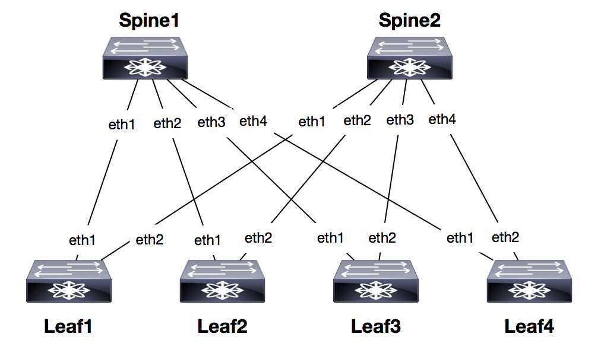

# Custom Topologies

Create custom labs and topology to emulate your network. We'll walk
through a simple example to help you get started.

For our custom topology, we'll use a CLOS network with 2 Spines and 4 Leaves 
as shown below:



## Step 1: Create a Package Directory for your Lab

The first step is to create a folder under dockerLabs/labs/ directory.  
We'll use the name 'myClosNetwork'.

```bash
agossett@docker-dev:~$ cd dockerLab/labs
agossett@docker-dev:~/dockerLab/labs$ mkdir myClosNetwork
```

Second, we'll need to create an **\_\_init\_\_.py** with a docstring that 
describes our lab. This allows the our myClosNetwork to appear as a 
discoverable package to  **labtool**.
The first line of the docstring must be in the format of
"id:Name" and a multiline description can follow after. For example:

```bash
# Ensure you are in the myClosNetwork directory
agossett@docker-dev:~/dockerLab/labs/myClosNetwork$ 

agossett@docker-dev:~/dockerLab/labs/myClosNetwork$ echo '"""
> myClosNetwork: my custom lab
> Check out this description of my custom lab!
> """' > __init__.py

agossett@docker-dev:~/dockerLab/labs/myClosNetwork$ cat __init__.py
"""
myClosNetwork: my custom lab
Check out this description of my custom lab!
"""
```

## Step 2: Create the Topology File

Next, we'll need to build the topology file. The topology file is a json
requiring 'devices' attributes and 'connections' attribute.  It must be
named **topology.json**

Each device will have a name and a unique port assigned.  Each connection 
will contain the source device, source port, destination device, and 
destination port.

The flexswitch API is exposed on port 8080 on each device. To reach this port
from outside of the container, **labtool** will map port 8080 on each container
to port defined in the topology file.  Our lab will use the following mappings:

| Device   | Container Port | Host Port |
| -------- |:--------------:| ---------:|
| leaf1    | 8080           | 8001      |
| leaf2    | 8080           | 8002      |
| leaf3    | 8080           | 8003      |
| leaf4    | 8080           | 8004      |
| spine1   | 8080           | 8005      |
| spine2   | 8080           | 8006      |

Create the **topology.json** file and copy it to the myClosNetwork directory

```bash
agossett@docker-dev:~/dockerLab/labs/myClosNetwork$ cat topology.json
{
    "devices":[
        {"name":"leaf1", "port":"8001"},
        {"name":"leaf2", "port":"8002"},
        {"name":"leaf3", "port":"8003"},
        {"name":"leaf4", "port":"8004"},
        {"name":"spine1", "port":"8005"},
        {"name":"spine2", "port":"8006"}
    ],
    "connections":[
        {"spine1":"eth1","leaf1":"eth1"},
        {"spine1":"eth2","leaf2":"eth1"},
        {"spine1":"eth3","leaf3":"eth1"},
        {"spine1":"eth4","leaf4":"eth1"},
        {"spine2":"eth1","leaf1":"eth2"},
        {"spine2":"eth1","leaf2":"eth2"},
        {"spine2":"eth1","leaf3":"eth2"},
        {"spine2":"eth1","leaf4":"eth2"}
    ]
}
```

## Step 3: (Optional) Create stage files

If you would like to stage configurations for your lab, you can create 
stage files that apply the needed configuration to each device. The 
files must be named "stage<#>.sh" and must be created in sequential order.

The stage files are always executed in order.  For example, if there are
two stage files (stage1.sh and stage2.sh), and the user executes the 
custom lab with --stage 1 option, then all curl commands in stage1.sh will
be applied.  If the user executes the custom lab with --stage 2 option,
then all curl commands in stage1.sh will be applied followed by all curl
commands in stage2.sh

For the example lab, we'll create a stage1.sh file that enables LLDP on
all devices.  Note, the commands are executed from outside the container
so the http port number in the curl command is unique to each device.

```bash
agossett@docker-dev:~/dockerLab/labs/myClosNetwork$ cat stage1.sh
#!/bin/bash
# stage scripts execute command outside of container instance on custom port

# enable LLDP on leaf1
curl -sX PATCH -d '{"Enable":true}' 'http://localhost:8001/public/v1/config/LLDPGlobal'

# enable LLDP on leaf2
curl -sX PATCH -d '{"Enable":true}' 'http://localhost:8002/public/v1/config/LLDPGlobal'

# enable LLDP on leaf3
curl -sX PATCH -d '{"Enable":true}' 'http://localhost:8003/public/v1/config/LLDPGlobal'

# enable LLDP on leaf4
curl -sX PATCH -d '{"Enable":true}' 'http://localhost:8004/public/v1/config/LLDPGlobal'

# enable LLDP on spine1
curl -sX PATCH -d '{"Enable":true}' 'http://localhost:8005/public/v1/config/LLDPGlobal'

# enable LLDP on spine2
curl -sX PATCH -d '{"Enable":true}' 'http://localhost:8006/public/v1/config/LLDPGlobal'
```

## Run It

At this point, **labtool** will detect the custom topology and corresponding stages.

```

agossett@docker-dev:~/dockerLab$ sudo ./labtool.py --describe

The following 2 labs are available:

********************************************************************************
--lab lab1
  Name: Introduction to Flexswitch
  Stages: 4
  Description:
This lab serves as an introduction to SnapRoute Flexswitch.  It uses a three
node, full-mesh topology and walks the user through basic interface
configuration and validation. eBGP is configured and loopback interfaces are
redistributed along with route validation.
********************************************************************************
--lab myclosnetwork
  Name: An Example Custom Topology
  Stages: 1
  Description:
Create custom topology and staging files to emulate your network. See the
documentation under the custom lab for more details

# Run our custom topology!
agossett@docker-dev:~/dockerLab$ sudo ./labtool.py --lab myclosnetwork --stage 1
EDT 2017-05-20 21:38:28  checking docker state
EDT 2017-05-20 21:38:28  creating container spine1
EDT 2017-05-20 21:38:29  creating container leaf4
EDT 2017-05-20 21:38:29  creating container spine2
EDT 2017-05-20 21:38:30  creating container leaf1
EDT 2017-05-20 21:38:31  creating container leaf3
EDT 2017-05-20 21:38:31  creating container leaf2
EDT 2017-05-20 21:38:32  creating connection  leaf4:eth1 - spine1:eth4
EDT 2017-05-20 21:38:32  creating connection  leaf4:eth2 - spine2:eth4
EDT 2017-05-20 21:38:33  creating connection  leaf1:eth1 - spine1:eth1
EDT 2017-05-20 21:38:33  creating connection  leaf1:eth2 - spine2:eth1
EDT 2017-05-20 21:38:33  creating connection  leaf3:eth1 - spine1:eth3
EDT 2017-05-20 21:38:34  creating connection  leaf3:eth2 - spine2:eth3
EDT 2017-05-20 21:38:34  creating connection  leaf2:eth1 - spine1:eth2
EDT 2017-05-20 21:38:35  creating connection  leaf2:eth2 - spine2:eth2
EDT 2017-05-20 21:38:35  waiting for flexswitch to start...
EDT 2017-05-20 21:40:05  timeout expired, restarting flexswitch on spine1
EDT 2017-05-20 21:40:06  timeout expired, restarting flexswitch on leaf4
EDT 2017-05-20 21:40:07  timeout expired, restarting flexswitch on spine2
EDT 2017-05-20 21:40:08  timeout expired, restarting flexswitch on leaf1
EDT 2017-05-20 21:40:09  timeout expired, restarting flexswitch on leaf3
EDT 2017-05-20 21:40:10  timeout expired, restarting flexswitch on leaf2
EDT 2017-05-20 21:40:11  waiting for flexswitch to start...
EDT 2017-05-20 21:40:28  flexswitch is running on all containers
EDT 2017-05-20 21:40:28  applying stage 1 configuration
EDT 2017-05-20 21:40:28  Successfully started ' An Example Custom Topology'

```


